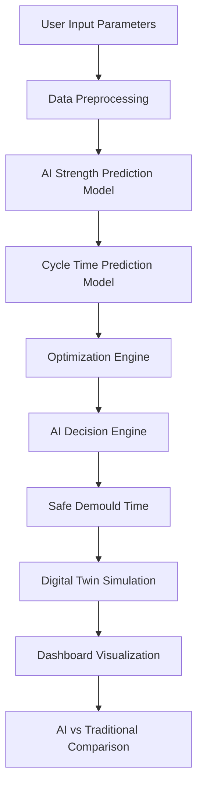

# 🚀 AI-Powered Cycle Time Optimization for Precast Yards

### L&T CreaTech 2026 – Problem Statement 1 Solution

---

## 📌 Overview

This project presents an **AI-driven decision support system** for optimizing **precast concrete production cycle time**.
The system predicts **concrete strength**, estimates **optimal curing duration**, and recommends **early demoulding decisions** to improve yard productivity.

The solution replaces traditional fixed curing practices with **data-driven adaptive optimization**, enabling faster construction execution and efficient resource utilization.

---

## 🎯 Problem Statement

In precast construction, cycle time from **casting → curing → demoulding** directly affects:

* Project timeline
* Yard throughput
* Equipment utilization
* Production cost

Traditional methods rely on static curing assumptions, causing delays and inefficiencies.

✅ This system dynamically optimizes production using **Machine Learning + Digital Twin Simulation**.

---

## 🧠 Solution Highlights

* AI prediction of concrete strength
* Cycle-time optimization
* Autonomous demould decision engine
* Real-time parameter simulation
* Digital Twin of precast yard
* AI vs Traditional performance comparison dashboard

---

## ⚙️ Tech Stack

| Category         | Technology            |
| ---------------- | --------------------- |
| Backend          | FastAPI               |
| Machine Learning | Scikit-Learn, XGBoost(For testing)  |
| Data Processing  | Pandas, NumPy         |
| Frontend         | HTML, CSS, JavaScript |
| Visualization    | Chart.js              |
| Model Storage    | Joblib (.pkl)         |
| Deployment       | Render                |
| Version Control  | Git & GitHub          |

---

## 🔄 System Workflow



---

## 📊 Input Parameters

* Temperature (°C)
* Humidity (%)
* Water–Cement Ratio
* Cement Type
* Curing Time

---

## 🤖 Model Outputs

* Predicted Concrete Strength (MPa)
* Optimized Cycle Time (hrs)
* Safe Demould Time
* Production Gain (%)
* Operational Status

---

## 🏭 Digital Twin Simulation

The dashboard simulates real precast yard stages:

* Casting Zone
* Curing Zone
* Ready for Demould Zone

AI dynamically updates production readiness based on predicted curing performance.

---

## 📈 Performance Improvement

| Method             | Cycle Time |
| ------------------ | ---------- |
| Traditional Method | 48 hrs     |
| AI Optimized       | ~30–36 hrs |

✅ **Up to 30% faster production cycle**
✅ Improved yard throughput
✅ Reduced idle time

---

## 🧩 Project Structure

```
CreaTech2026/
│
├── api/
│   └── app.py
├── models/
│   ├── strength.pkl
│   └── cycle.pkl
├── optimizer/
│   └── cycle_optimizer.py
├── utils/
│   └── preprocess.py
├── data/
│   └── precast_data.csv
├── templates/
│   └── index.html
├── requirements.txt
└── README.md
```

---

## ▶️ Run Locally

```bash
pip install -r requirements.txt
uvicorn api.app:app --reload
```

Open browser:

```
http://127.0.0.1:8000
```

---

## 🌐 Live Prototype

Deployed using **Render Cloud Platform**

🔗 Live Demo: https://createch2026.onrender.com

---

## 🔬 Key Innovation

Unlike conventional curing approaches, this system:

* Adapts curing strategy using environmental data
* Predicts optimal production timing
* Enables intelligent early demoulding
* Supports scalable infrastructure projects

---

## ✅ Conclusion

The proposed AI system successfully addresses **L&T CreaTech PS-1** by transforming precast yard operations into an **autonomous, data-driven optimization framework**, improving productivity, efficiency, and decision-making reliability.

---

## 👨‍💻 Author

**Priyadarshi Prince**
B.Tech – IIT Patna
Full Stack Developer | Machine Learning Engineer

---

⭐ *If you find this project useful, consider giving it a star!*
